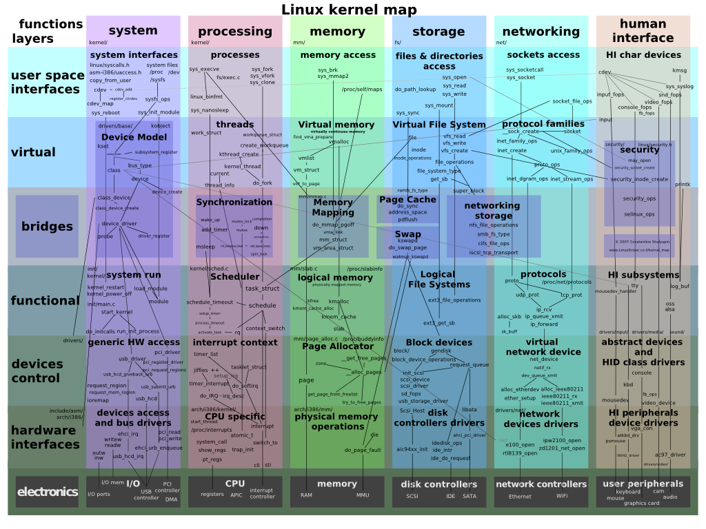

# Intro

# Unix

Linux is considered a [Unix-like][ul] operating system which basically means that Linux derives heavy inspiration from Unix without actually conforming to be a full Unix operating system. macOS and FreeBSD would be two more examples of a Unix-like operating system.

Unix was created in the 70s at Bell Labs (from which descended AT&T) and has pretty much inspired every operating system created since then. Nearly everything you're going to learn today was originated in Unix itself. A big part of Unix software is the idea of the "[Unix philosophy][up]" which is a sort of digital minimalism when it comes to coding. The idea is instead of having a few very specialized tools (or programs) we should have many small, composable tools that we can use to compose to solve larger problems. The influence of this is still felt and talked about today. Hopefully today you'll learn many of these principles. Here's what they originally wrote:

- Make each program do one thing well. To do a new job, build afresh rather than complicate old programs by adding new "features".
- Expect the output of every program to become the input to another, as yet unknown, program. Don't clutter output with extraneous information. Avoid stringently columnar or binary input formats. Don't insist on interactive input.
- Design and build software, even operating systems, to be tried early, ideally within weeks. Don't hesitate to throw away the clumsy parts and rebuild them.
- Use tools in preference to unskilled help to lighten a programming task, even if you have to detour to build the tools and expect to throw some of them out after you've finished using them.

I still think there's a lot of wisdom here and it's something I try to incorporate into my coding.

# Linux

Again, Linux isn't directly Unix, just directly inspired by it, and incorporates many of its ideas and interfaces into it. It was created in 1991 by Linus Torvalds who is still an influential figure today and still runs the Linux project. He created Linux because at the time there was no single free, open-source reimplementation of the Unix operating system (the BSD kernel wasn't yet available yet) so he wrote his own kernel which became known as the Linux kernel.

From here the project took off and was adopted far and wide. (As of writing) all of the top 500 super computers run on Linux, much of the mobile phone market share (thanks to Android being based on Linux), and many of the servers running your favorite websites. Suffice to say, Linux is incredibly important to the modern computing world.

# Why Linux

So why Linux over other operating systems?

First, it's free. Anyone can use Linux to do anything without paying anyone a dime. This is useful for college students who don't have any money but it's also critical for large businesses running thousands or tens-of-thousands of servers. It can save them millions of dollars to not have to pay for an operating system.

It's very well maintained. Because Linux is such a popular operating system, it has a lot of eyes on it. Engineers from all over the world and all over the industry are constantly contributing fixes and new features to Linux, both on their own free time and during the course of their jobs.

It runs just about anywhere. Linux not only runs on x86 (the Intel / AMD processor architecture your computer is likely using) but it runs on Internet-of-Things devices, phones, fridges, cars, etc. If it has a processor in it, chances are you can get Linux running on it already.

Most of the the things you need already exist for it. Linux already has many of the tools one would need to run servers, devices, media, etc. all on it already, meaning you wouldn't need to create it. Linux has a rich ecosystem of programs available that are also likely free.

The knowledgebase for Linux is enormous. Having a problem? Chances are someone else already had the same problem and you can find the solution on StackOverflow or someone's blog. Because the knowledgebase is so large, it's really easy to hire someone with deep knowledge of Linux and for you it's profitable to learn Linux because so many jobs demand the skillset.

# What Makes Linux, Linux

At its core, Linux is the kernel. Anything based on this Linux kernel is a considered a Linux distribution, or distro for short.

# Distros

There are so, so, so many distros of Linux. They all do different things well and some of them are very specialized in what sorts of things they can accomplish. I'm going to only introduce you primarily to one through the course of this class, [Ubuntu][ubuntu], but that's not say there aren't many good reasons to choose other ones.

Why are we choosing Ubuntu? It's a very good choice for many different use cases. In my opinion, it's the best general purpose distro for many use cases. It's a _downstream_ distro of [Debian][debian] where downstream means that Ubuntu builds upon the base of Debian. Ubuntu is a very polished (when I say polished I mean it has a nice interface) distro of Linux which I think it is the easiest to use. It's backed a company called Canonical who puts a lot of love into the distro and they're definitely one of my favorite companies.

Ubuntu is a great choice for running Linux on as your main OS (I don't), for servers in the cloud, for IoT, or for any other of myriad things. It's a really great, flexible distribution.

I'll toss a few of the other, more popular distros for you to take a look at too. I haven't used all of them but they're popular enough that they merit a look from you.

- [Debian][debian]
- [Mint][mint]
- [Red Hat][rhel]
- [Alpine][alpine]
- [Kali][kali]
- [CentOS][centos]

[ul]: https://en.wikipedia.org/wiki/Unix-like
[up]: https://en.wikipedia.org/wiki/Unix_philosophy
[debian]: https://www.debian.org/
[ubuntu]: https://ubuntu.com/
[rhel]: https://www.redhat.com/en/technologies/linux-platforms/enterprise-linux
[alpine]: https://www.alpinelinux.org/
[kali]: https://www.kali.org/
[centos]: https://www.centos.org/
[mint]: https://linuxmint.com/
